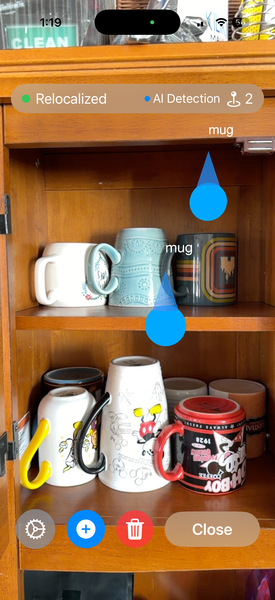
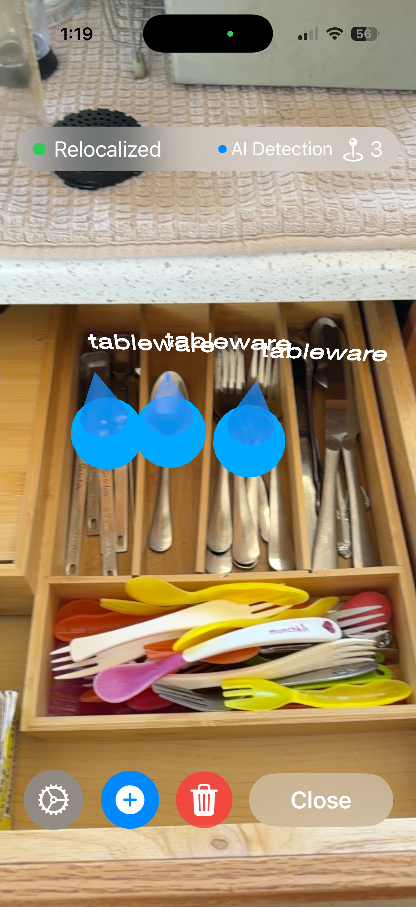
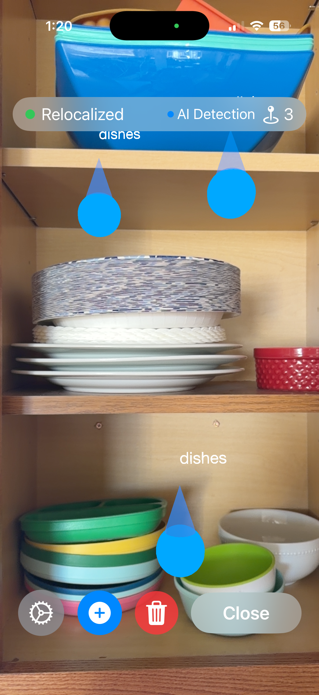

# DishSpot

DishSpot transforms your iPhone into an intelligent spatial assistant that finds, tracks, and remembers objects in your physical space.

| Mugs | Silverware | Plates | DishCaddie |
|:---:|:---:|:---:|:---:|
|  |  |  |  |

## What DishSpot Does

**Scan & Detect**  
Point your camera at any room and DishSpot instantly identifies objects using custom Roboflow computer vision models.

**Map to Reality**  
Every detected object gets precisely positioned in 3D space through real-world raycasting, creating an accurate spatial map of your environment.

**Integrate Your Models**  
Connect one or more Roboflow models to detect exactly what matters to you—from kitchen items to tools to specialized equipment.

## Build Your Own
[Model](https://app.roboflow.com/dewy-golf/dishes-xuwup-zgkm3/models)

[Source Dataset](https://universe.roboflow.com/cyut/dishes-xuwup)

@misc{
                            dishes-xuwup_dataset,
                            title = { dishes Dataset },
                            type = { Open Source Dataset },
                            author = { cyut },
                            howpublished = { \url{ https://universe.roboflow.com/cyut/dishes-xuwup } },
                            url = { https://universe.roboflow.com/cyut/dishes-xuwup },
                            journal = { Roboflow Universe },
                            publisher = { Roboflow },
                            year = { 2022 },
                            month = { aug },
                            note = { visited on 2025-11-17 },
                            }

## Coming Soon

**Persistent Memory**  
DishSpot will save AR anchors to your world map, eliminating the need to rescan destinations every time you use the app.

**Visual Navigation**  
Once you detect an item that needs putting away, follow intuitive AR arrows that guide you directly to its destination.
**Smart Cabinet Detection**  
Automatically recognize whether cabinets and storage spaces are open or closed, making organization even more seamless.

## Beyond the Kitchen

This spatial intelligence technology has powerful applications across industries:

- **Construction Management** — Track tools, materials, and equipment across job sites
- **Robotic Navigation** — Enable robots to understand and navigate complex real-world environments
- **Medical Practice** — Locate instruments, supplies, and equipment in clinical settings

---

*Built with ARKit, RealityKit, and Roboflow*
